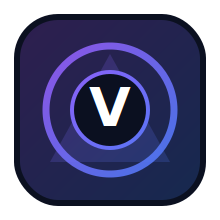

# Vaeloryn-Conclave

<p align="center">
  
</p>


[](https://ko-fi.com/smouj013_dev)

<p align="center">
  <a href="./README.md"></a>
  <a href="./README.es.md"></a>
</p>

**Multi-agent council for strategic consensus and execution.**

## Vision
Vaeloryn-Conclave is a collaborative multi-agent coordination skill that structures role-based deliberation and consensus-driven decisions. It is designed for complex problems where multiple reasoning perspectives must converge into a single actionable outcome.

## Core Superpower
- ⚡ **Role-based deliberation with auditable final decisions**

## Current Status (February 2026)
- 🚧 Ideation and robust scaffolding phase
- Next milestones:
  - [ ] Finalize domain contracts and interfaces
  - [ ] Ship a minimal runnable CLI command
  - [ ] Add Ollama local model profile and fallback strategy
  - [ ] Implement one complete end-to-end example
  - [ ] Add quality gates (lint, typecheck, test)
  - [ ] Publish architecture and operational runbook

## Planned Architecture (free/open-source stack)
- **Primary language:** Python 3.11+
- **Agent framework:** AutoGen
- **Local models:** Ollama (Llama 3.1, Qwen2.5, DeepSeek-Coder, Mistral)
- **Core dependencies:** networkx, pyyaml, pydantic, redis, fastapi
- **Execution model:** local-first, optional self-hosted deployment

## Capability Blueprint
- ✅ Agent role contracts
- ✅ Debate rounds
- ✅ Consensus protocol
- ✅ Decision audit logs
- ✅ Execution delegation


## Project Structure
```text
Vaeloryn-Conclave/
├── src/vaeloryn_conclave/
│   ├── core/           # domain orchestration and policies
│   ├── adapters/       # external integrations and tool bridges
│   ├── memory/         # state, retrieval, and context strategies
│   └── cli.py          # local operator command interface
├── docs/
│   ├── IMPLEMENTATION.md
│   ├── ARCHITECTURE.md
│   └── RUNBOOK.md
├── examples/
├── tests/
├── requirements.txt
└── README.md
```

## Quick Start
```bash
git clone https://github.com/smouj/Vaeloryn-Conclave.git
cd Vaeloryn-Conclave
python -m venv .venv
source .venv/bin/activate  # Windows: .venv\Scripts\activate
pip install -r requirements.txt
python -m src.vaeloryn_conclave.cli --help
```

## Documentation
- [Implementation Guide](./docs/IMPLEMENTATION.md)
- [Architecture](./docs/ARCHITECTURE.md)
- [Runbook](./docs/RUNBOOK.md)
- [Deployment Guide](./docs/DEPLOYMENT.md)
- [Release Process](./docs/RELEASE.md)
- [Changelog](./CHANGELOG.md)
- [Contributing](./CONTRIBUTING.md)

## Contributing
Contributions are welcome. Please read **CONTRIBUTING.md** before opening issues or PRs.

## License
MIT © 2026 smouj